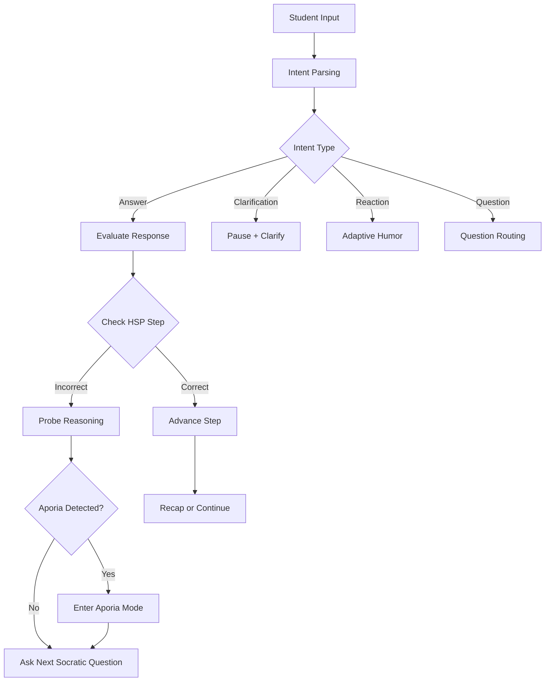

## Dialogue Engine Design

### Overview

The **Dialogue Engine** is the core orchestration module that translates Meno’s pedagogical principles into live, adaptive conversation.
It coordinates:

* Socratic questioning
* Student interjections
* Aporia detection and recovery
* Humor and engagement tone
* Step progression through the Hidden Solution Plan (HSP)

The engine acts as the **“mind” of Meno**, transforming the static HSP into a living dialogue that flexes with student reasoning, collaboration, and personality.

---

### Core Pipeline

#### 1. **Intent Parsing**

Each student message is classified into one of several **intent types**:

* `answer` — direct mathematical response
* `clarification` — seeking to understand a concept
* `question` — student posing a new inquiry
* `reaction` — emotional or humorous response
* `meta` — comments about the session itself

> **Tools:**
>
> * OpenAI LLM (function-calling schema for intent classification)
> * Lightweight text classifiers (spaCy / fastText fallback)

#### 2. **Question Selector**

The engine draws the next Socratic question from the **HSP** while rotating across question types (definitional, analytical, proportional, spectral, evaluative).
Selection is guided by:

* Current HSP step
* Student’s last response quality
* Engagement score (e.g., time since last input, tone of message)
* Session phase (Exploration, Aporia, Resolution)

> **Tools:**
>
> * Question template library (JSON-based)
> * Inference model (LLM) for dynamic question synthesis
> * Rule-based fallback templates for each math domain

#### 3. **Response Evaluation**

Each student reply is compared to the expected `check()` from the HSP:

* **Exact / symbolic match:** advance to next step.
* **Partial / conceptual match:** affirm, probe further (“That’s close — what’s still missing?”).
* **Incorrect but reasoned:** explore reasoning before redirecting (“Let’s see where that leads.”).

> **Tools:**
>
> * SymPy for symbolic validation
> * Fuzzy string matching for numeric/algebraic forms
> * Contextual scoring model for reasoning completeness

#### 4. **Aporia Detection**

Detects moments when the student (or group) is confused but engaged — a hallmark of learning.

**Signals include:**

* Contradictory statements within last few turns
* Repeated invalid reasoning paths
* Longer pauses or hedged responses (“I think,” “maybe,” “not sure”)
* Emotional indicators (frustration, laughter, silence)

When triggered, Meno transitions into *Aporia Mode*:

* Acknowledges confusion positively: “This is the good kind of stuck.”
* Reframes the question with a simpler analogy or visual.
* Keeps tone calm, even playful: “Let’s chase that thought — see where it goes.”

> **Tools:**
>
> * Sentiment analysis (DistilRoBERTa / HuggingFace pipeline)
> * Rule-based contradiction detectors
> * Conversational state memory with timestamp deltas

#### 5. **Interruption Handling**

Meno remains interruptible — but interruption management is structured.

**Rules:**

* Interjection pauses current prompt, but session context remains frozen.
* Clarification answers are short, then conversation resumes automatically.
* After three consecutive interruptions, Meno sets a “Focus Lock”:

  > “Let’s finish this step first, then I’ll answer that fully.”

> **Tools:**
>
> * Local queue for deferred responses (“parking lot” memory)
> * Timeout controller for pending follow-ups

#### 6. **Humor and Personality Layer**

Wit is contextually generated and **relevant to the student** — derived from:

* Session tone (serious / light / group dynamic)
* Student’s age group or context tag (middle school, high school, adult learner)
* Recent inputs (e.g., Meno mirrors a student’s phrasing or joke style)

Examples:

* If a student says, “My brain hurts,” Meno replies: “That’s the sound of learning weightlifting.”
* If a student miscalculates amusingly: “Close! You just gave x a surprise promotion.”

**Rules for humor:**

* Must reinforce reasoning, not distract from it.
* Never rely on academic or cultural references the student might not know.
* Maximum one humorous remark every 5–7 turns.

> **Tools:**
>
> * Humor intent model (LLM few-shot pattern generation)
> * Student profile tags (age, region, tone preference)
> * Safety filters for content appropriateness

#### 7. **Recap Mode**

At the end of each problem, Meno provides a brief but articulate synthesis:

* Summarizes the steps taken (from the HSP).
* Restates reasoning flow in the student’s own language.
* Ends with reflection: “What part of this felt most confusing at first — and what made it clear?”

---

### Dialogue Control Logic

---

### Data and State Management

| Component                | Purpose                                     | Persistence                        |
| ------------------------ | ------------------------------------------- | ---------------------------------- |
| **Dialogue Memory**      | Maintains last N turns for coherence        | Session memory (Redis or Supabase) |
| **HSP Tracker**          | Current step, progress, and alternate paths | Persistent session object          |
| **Interruption Queue**   | Pending follow-ups and clarifications       | Volatile (cleared on session end)  |
| **Humor Context Buffer** | Tracks prior jokes, style preferences       | Volatile (per student)             |

---

### Tools and Dependencies Summary

| Category            | Tools / Libraries                     | Role                                               |
| ------------------- | ------------------------------------- | -------------------------------------------------- |
| **LLM Backend**     | OpenAI Assistants API                 | Primary reasoning + language generation            |
| **NLP Utilities**   | spaCy, HuggingFace, fastText          | Intent parsing, tone detection                     |
| **Math Engine**     | SymPy                                 | Equation validation, hint generation               |
| **Realtime Sync**   | WebSocket, Yjs/CRDT                   | Whiteboard and dialogue sync                       |
| **OCR / Vision**    | MathPix, GPT-4 Vision                 | Problem ingestion (image-based)                    |
| **Backend Runtime** | Node.js (TypeScript)                  | Orchestration and routing                          |
| **Database**        | Supabase / Postgres                   | Sessions, transcripts, progress                    |
| **Analytics**       | OpenTelemetry, Mixpanel               | Engagement metrics, latency, aporia detection logs |
| **Safety**          | Content filter + relevance heuristics | Ensures humor and tone appropriateness             |

---

### Pedagogical Safeguards

* **Aporia Frequency Cap:** At most one deep aporia per problem (prevents frustration).
* **Turn Limit:** 15–20 conversational turns per problem (maintain rhythm).
* **Clarification Buffer:** Clarifications batch and are addressed after a full reasoning step.
* **Team Integration:** For group sessions, Meno occasionally prompts collective reasoning:

  > “Does anyone see a different path?”
  > “Let’s check what each of us assumed here.”

---

### Summary

The Dialogue Engine transforms the Socratic method into a **structured, collaborative reasoning system** by:

* Keeping dialogue short, engaging, and improvisational.
* Allowing interruptions without chaos.
* Blending humor, imagination, and logic in service of understanding.
* Leading students into — and out of — **aporia** through guided reasoning.

Meno thus behaves not as a static tutor but as a **living dialectical partner** — equal parts philosopher, teammate, and comedian of reason.

